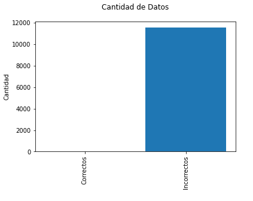
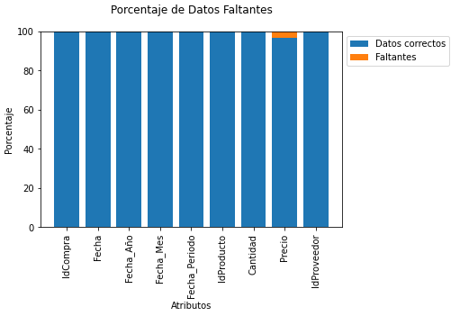

# Reporte Tabla Compras

## Exploración Inicial

El Atributo de la fecha tiene el siguiente caracter (/) como separador de la fecha. Es necesario la corrección para que pueda ser usada la informacion en otros análisis.

Cambiar al separador de un guion medio (-)

> ## Recomendacion_1

Cambiar el formato de la fecha, actualmente es Mes-Dia-Año y debe ser del formato Año-Mes-Dia

En el atributo de Precio, hay una cantidad de faltante de datos de aproxiamdamente 3%, es eñ único campo que no tiene toda la informacion.

> ## Recomendacion_2

Se pueden completar los datos faltantes con valores nulos para no perder el registro.

> ## Link hacia el diccionario de la Tabla Compras

[Diccionario Tabla Compras](./diccionario_tabla_compras.md)
