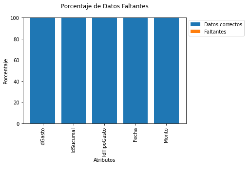
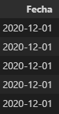

# Reporte Tabla Gastos

## Exploración Inicial

La tabla no presenta valores faltantes o datos incorrectos, además el formato de fecha coincide con el siguiente: Año-Mes-Dia

> ### Datos Faltantes

> ### Fecha con formato correcto

> ## Link hacia el diccionario de la Tabla Gastos

[Diccionario Tabla Gastos](./diccionario_tabla_gastos.md)
