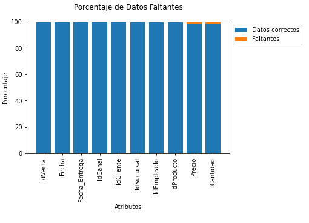

# Reporte Tabla Ventas

## Exploración Inicial

En la Tabla de __Ventas__ hay valores faltantes en las siguientes columnas:

- Precio
- Cantidad

Que corresponden con un porcentaje aproximado de 2% de Diferencia

  

> ## Recomendación

Poder encontrar los datos faltantes y agregar en el registro. Además de poder agregar un valor Nulo/Vacio para mantener el registro y luego crear una nueva tabla con los filas Nulas removidas.

Otra opción es poder Agrupar de acuerdo al IdProducto y calcular el Precio Promedio para completar esa información faltante.

Sin embargo aún estaría faltando la información de la cantidad del producto vendido.

> ## Propuestas

Agregar una nueva columna a la tabla de Ventas con el __Total Vendido__ puede ser de ayuda para otros análisis esa información.

> ## Link hacia el diccionario de la Tabla Ventas

[Diccionario Tabla Ventas](./diccionario_tabla_ventas.md)
